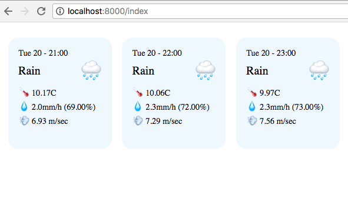

# ReasonML server and client example

A minimal example of a Reason client-server web application.

## Why? 

AFAICT there isn't many example of server-side Reason code using OCaml libraries (instead of node.js). 

Our server is a little HTTP server written using OCaml's Cohttp library (https://github.com/mirage/ocaml-cohttp).
This server calls DarkSky's API (https://darksky.net/dev) to retrieve a 48 hours weather forecast for a given location, and return a subset of that data to its clients.

The client is written as a ReasonReact program, it sends its location to the server and displays the forecast like this (see screenshot below).




## Client

### overview

The weather component first tries to access the client location via ```Geo.getLocation``` (using ```navigator.geolocation.getCurrentPosition``` via the FFI ). If successful, it gets back the position via the ```sendPos``` callback. If an error occurs, it gets back an error message via the ```sendErr``` callback.

When the message ```PosLoaded(lat,lon)``` is received we call the server via ```Api.fetchTemperature```. This function fetch the data and parse the JSON response into an ```Api.point``` value. Then we send the ```DataLoaded(pts)``` message.

When the message ```DataLoaded(pts)``` is received, we update the internal state, which causes re-rendering. 

```render``` maps over a list of weather data points to turn them into a list of ```Point``` components. 

The ```Point``` component is stateless, it only formats data and generates HTML.


### prerequisites

* as well as ```reason-react```, we use the ```bs-json``` and ```bs-fetch``` libraries

### to build

    $ cd client
    $ npm install
    $ npm run build
    $ npm run webpack

## Server 

### overview

The server uses Lwt, a cooperative threading library. Lwt values are monadic and must be composed via the usual monadic operators ```>>=``` (bind) and ```return``` (see tutorial: https://mirage.io/wiki/tutorial-lwt), so instead of:

```
printf("HTTP server started on port %s\n", string_of_int(port));
Server.create(~mode=`TCP(`Port(port)), Server.make(~callback, ()));
```

we have to write:

```
 Lwt_io.printf("HTTP server started on port %s\n", string_of_int(port))
  >>= (
    (_) => Server.create(~mode=`TCP(`Port(port)), Server.make(~callback, ()))
  );
```

To create a server, we define a function ```callback```, it parses the request URI and handles the following "routes": 

* ```/index.js```: serves the file ```./index.js``` (which contains the compiled ReasonReact client code)
* ```/index```: serves the file ```./index.html```
* ```/weather/LAT/LON```:  returns the forecast for latitude ```LAT``` and longitude ```LON``` as JSON

The function ```darsky(key, lat, lon)``` calls the api and extracts a subset of the JSON data into a ```Datapoint.t``` value, via the function ```Datapoint.of_json```.

Note that, because ```callApi``` returns a Lwt value (```Lwt.t(string)```), the result of ```dataPoints``` needs to be lifted to a Lwt.t value (here, via ```>|=```).

Finally, we convert our datapoint values to JSON with ```string_of_datapoints``` (the ``` `A``` constructor is the array constructor in ```Ezjsonm```, the JSON library we are using here).     


### prerequisites

* you need to put your DarkSky API key in the `DARKSKY_API_KEY` environment variable
* you need the OCaml 4.02.3+buckle-master compiler
* libraries you need to install: lwt, cohttp, ezjsonm and re 

```
$ export DARKSKY_API_KEY=YOUR_KEY_HERE
$ opam switch 4.02.3+buckle-master
$ opam update
$ opam install reason merlin re tls lwt cohttp ezjsonm
```

### to build

    $ cd server
    $ make build
    $ export DARKSKY_API_KEY=<your_api_key>
    $ make start

## Docker

Alternatively, you can use docker to build a container with all the client and server code. 

First, edit the Dockerfile and replace <YOUR_KEY_HERE> with your API key.

Then, build the image and start the container:

```
$ docker build -t reason-client-server-example .
$ docker run -d -p 8000:8000 reason-client-server-example
```

## Demo

open http://localhost:8000/index in a browser
